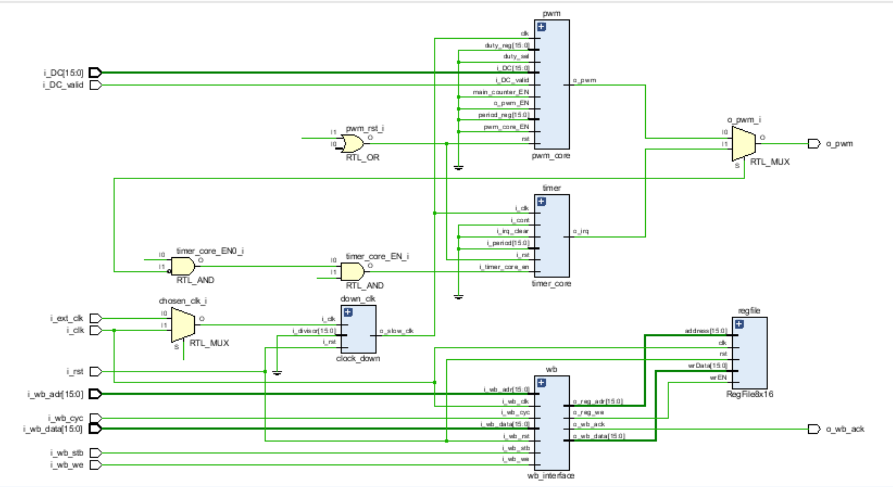

# Interface Documentation       

---      

## Table of Contents (TOC)  

- [Purpose of This File](#-purpose-of-this-file)
- [Design Overview](#-design-overview)
- [Elaborated Design Diagram](#-elaborated-design-diagram)
- [Top-Level Interface Signals](#-toplevel-interface-signals)
- [Intrenal Module Interfaces](#-intrenal-module-interfaces)
    1. [wb_interface](#1-wb_interface)
    2. [RegFile8x16](#2-regfile8x16)
    3. [clock_down](#3-clock_down)
    4. [pwm_core](#4-pwm_core)
    5. [timer_core](#5-timer_core)
- [Signal Connectivity Summary](#-signal-connectivity-summary)
- [Control Register Specs](#-control-register-specs)

---     

## 📄 Purpose of This File     

This document describes the external and internal intreface signals used in the design. It aims to clarify each signal's role, direction, and connectivity to ensure maintainability, and easier integration or debugging.  

---     

## 📦 Design Overview       

This hardware design integrates a PWM core, a timer core, a register file, a Wishbone interface. A clock divider and MUXs logic are used to seletc and manage clock sources. The design allows control of PWM and timer behavior via external signals and bus access.       

---     

## 🧭 Elaborated Design Diagram     

Below is the block diagram of the design, as generated during elaboration:    

  

---     

## 🔌 Top-Level Interface Signals      

| **Signal Name**   | **Direction** | **Width** | **Description**                                               |
|-------------------|---------------|-----------|---------------------------------------------------------------|
| i_clk             | input         | 1-bit     | Host clk signal (active-high)                                 |
| i_ext_clk         | input         | 1-bit     | External clk signal (active-high). Multi clk domains          |  
| i_rst             | input         | 1-bit     | Async. active-high reset signal                               | 
| i_wb_cyc          | input         | 1-bit     | Indicates the validity of a bus cycle                         | 
| i_wb_stb          | input         | 1-bit     | A master request signal for rd/wr                             | 
| i_wb_we           | input         | 1-bit     | Enables write operation                                       | 
| i_wb_adr          | input         | 16-bits   | The address from host to write data in it                     |
| i_wb_data         | input         | 16-bits   | The data to be written in the desired address                 | 
| i_DC              | input         | 16-bits   | External Duty Cycle signal. Multi DC choises                  | 
| i_DC_valid        | input         | 1-bit     | Indicates the validity of i_DC signal                         | 
| o_wb_ack          | output        | 1-bit     | Indicates that the operation is done successfully (rd/ wr)    | 
| o_pwm             | output        | 16-bits   | The modulated output signal                                   |

---     

## 🧩 Intrenal Module Interfaces   

### 1. wb_interface         

**Description**: an interface module iterfaces with the host. Take addresses and data from the host. Drive it the register file.

| **Signal Name**   | **Direction** | **Width** | **Description**                                               |
|-------------------|---------------|-----------|---------------------------------------------------------------|
| i_wb_clk          | input         | 1-bit     | Host clk signal                                               |
| i_wb_rst          | input         | 1-bit     | Async. active-high reset host reset signal                    | 
| i_wb_cyc          | input         | 1-bit     | Indicates the validity of a bus cycle                         | 
| i_wb_stb          | input         | 1-bit     | A master request signal for rd/wr                             | 
| i_wb_we           | input         | 1-bit     | Enables write operation                                       | 
| i_wb_adr          | input         | 16-bits   | The address from host to write data in it                     |
| i_wb_data         | input         | 16-bits   | The data to be written in the desired address                 | 
| o_wb_ack          | output        | 1-bit     | Indicates that the operation is done successfully (rd/ wr)    | 
| o_reg_adr         | output        | 16-bits   | Address from the host to write data in it                     | 
| o_reg_data        | output        | 16-bits   | Data from the host to be written in the desired address       | 
| o_reg_we          | output        | 1-bit     | Write enable from the host to enable write operataion         |

---     

### 2. RegFile8x16           

**Description**: a register file stores 4 registers (*ctrl*, *divisor*, *period*, *DC*) all with 16 data width.

| **Signal Name**   | **Direction** | **Width** | **Description**                                               |
|-------------------|---------------|-----------|---------------------------------------------------------------|
| clk               | input         | 1-bit     | Host clk signal (active-high)                                 |
| rst               | input         | 1-bit     | Async. active-high host reset signal                          |
| wrEN              | input         | 1-bit     | Write enable from the host                                    | 
| address           | input         | 16-bits   | The desired address from the host to write data in it         | 
| wrData            | input         | 16-bits   | The data to be written in the desired address                 | 

---   
### 3. clock_down            

**Description**: a clk divider module to devide the frequency of the input clk signal *i_clk* to get a slower clk frequency signal **o_slow_clk**.

| **Signal Name**   | **Direction** | **Width** | **Description**                                               |
|-------------------|---------------|-----------|---------------------------------------------------------------|
| i_clk             | input         | 1-bit     | Chossen clk from i_clk (host) or i_ext_clk (external)         | 
| i_rst             | input         | 1-bit     | Async. active-high reset signal                               | 
| i_divisor         | input         | 16-bits   | Divisor from register file                                    | 
| o_slow_clk        | output        | 1-bit     | The divided clk                                               |

---  

### 4. pwm_core             

**Description**: a module modulates the pulse width of input clk signal with respect to an input duty cycle signal whith is choosen from external duty cycle **i_DC** or duty cycle from register file **dc_reg**.

| **Signal Name**   | **Direction** | **Width** | **Description**                                               |
|-------------------|---------------|-----------|---------------------------------------------------------------|
| clk               | input         | 1-bit     | The choosen clk signal to be modulated                        | 
| rst               | input         | 1-bit     | Async. active-high reset signal                               | 
| duty_sel          | input         | 1-bit     | ctrl[6]. if set, i_DC. if not, dc_reg                         | 
| pwm_core_EN       | input         | 1-bit     | ctrl[1].                                                      | 
| main_counter_EN   | input         | 1-bit     | ctrl[2]. enables main counter to start counting               | 
| o_pwm_EN          | input         | 1-bit     | ctrl[4].                                                      | 
| period_reg        | input         | 16-bits   | Period from register file                                     | 
| duty_reg          | input         | 16-bits   | Duty cycle from register file                                 | 
| i_DC              | input         | 16-bits   | External duty cycle                                           | 
| i_DC_valid        | input         | 1-bit     | Indicates that i_DC is valid                                  | 
| o_pwm             | output        | 1-bit     | The modulated clk signal                                      | 

---   

### 5. timer_core         

**Description**: an interrupt request generator. Generates **irq** signal after a desired timer choosen w.r.t a given period signal.

| **Signal Name**   | **Direction** | **Width** | **Description**                                               |
|-------------------|---------------|-----------|---------------------------------------------------------------|
| i_clk             | input         | 1-bit     | Choosen clk from host *i_clk* or external *i_ext_clk*         | 
| i_rst             | input         | 1-bit     | Async. active-high. (i_rst | ctrl[7])                         | 
| i_timer_core_en   | input         | 1-bit     | (~ctrl[1] & ctrl[2]) chooses the timer over pwm core          | 
| i_cont            | input         | 1-bit     | ctrl[3]. If set, cont. else, one-shot                         | 
| i_irq_clear       | input         | 1-bit     | ctrl[5] interrupt clear request                               | 
| o_irq             | output        | 1-bit     | Interrupt output                                              |    

---   

 ## 🔁 Signal Connectivity Summary      

| **Source Module**     | **Source Port Name**      | **Destination Module**    | **Destinatin Port Name**      |
|---------------------- |---------------------------|---------------------------|-------------------------------|
| wb_interface          | o_reg_adr                 | RegFile8x16               | address                       | 
| wb_interface          | o_reg_data                | RegFile8x16               | wrData                        | 
| wb_interface          | o_reg_we                  | RegFile8x16               | weEN                          |
| clock_down            | o_slow_clk                | timer_core & pwm_core     | i_clk & clk                   | 
| RegFile8x16 (internal)| REG [02] == divisor       | clock_down                | i_divisor                     |
| RegFile8x16 (internal)| REG [04] == period        | pwm_core                  | period_reg                    | 
| RegFile8x16 (internal)| REG [06] == duty cycle    | pwm_core                  | period_reg                    | 
| RegFile8x16 (internal)| REG [04] == period        | timer_core                | i_period                      | 

---         

## Control Register Specs

| **ctrl[?]**   | **Description**                                                                               |   
|---------------|-----------------------------------------------------------------------------------------------|
| ctrl[0]       | If set, **i_ext_clk** will be chosen to be down clocked. Else, **i_wb_clk** will be chosen.   |  
| ctrl[1]       | If set, **o_pwm** will be chosen from **pwm_core** module. Else, from **timer_core**.         |
| ctrl[2]       | If set, *main counter* in **pwm_core** & **timer_core** starts. Else, stops.                  | 
| ctrl[3]       | If set, **timer_core** runs *continuously*. Else, **timer_core** runs for *one-shot*.         |       
| ctrl[4]       | If set, the modulated output will be outputed on **o_pwm**.                                   |
| ctrl[5]       | If reset, **irq_clear** signal is generated to stop *continouts* mode on **timer_core**.      |
| ctrl[6]       | If set, **i_DC** is chosen for **pwm_core**. Else, **duty_reg** is chosen.                    |
| ctrl[7]       | If set, resets the main counter, **o_pwm**, and ctrl [5]. Acts as reset signal.               | 